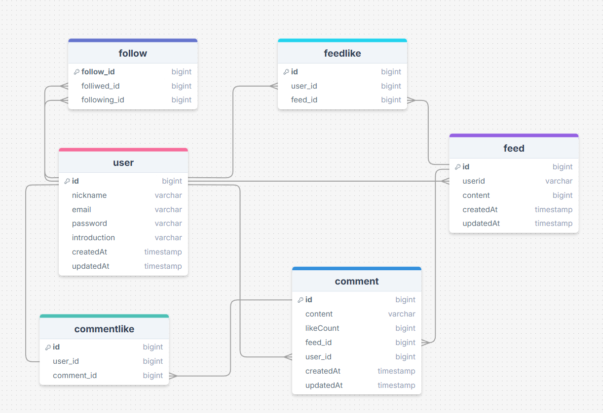

# 💌NewsFeed Project

소셜 네트워크 형태의 뉴스피드 기반 서비스로, 사용자가 글을 작성하고 댓글·좋아요·팔로우 등 다양한 방식으로 상호작용할 수 있는 플랫폼입니다.
도메인 단위로 패키지를 분리해 유지보수성과 확장성을 높였으며, JWT 기반 인증을 통해 보안과 안정성을 확보한 구조로 설계되었습니다.

# 📝 프로젝트 개요

사용자가 피드를 올리고, 댓글·좋아요·팔로우를 통해 소통하는 SNS 형태의 뉴스피드 서비스입니다.
도메인 단위 아키텍처를 적용해 기능별 확장성과 유지보수성을 높였고, JWT 인증을 기반으로 안전한 사용자 인증 환경을 제공합니다.

# 😈 ERD



# ⭐ 핵심 서비스

- 피드 게시

- 글 작성, 조회, 수정, 삭제

- 팔로우 기반 타임라인 제공

- 댓글 기능

- 댓글 작성, 조회, 삭제

- 좋아요 기능

- 피드 및 댓글 좋아요 / 취소

- 좋아요 수 응답 포함

- 팔로우 기능

- 팔로우/언팔로우

- 팔로잉 기반 피드 구성

- 인증/인가

- JWT 기반 로그인 및 요청 인증 처리

## 📌 주요 기능
### ✔ 사용자(User)

- 회원가입/로그인

- 사용자 정보 조회

- 본인 피드·댓글·팔로우 관리

### ✔ 피드(Feed)

- 게시글 작성/수정/삭제

- 최신순·팔로우 기반 타임라인 조회

### ✔ 댓글(Comment)

- 피드 댓글 작성

- 댓글 목록 조회 / 삭제

### ✔ 좋아요(FeedLike / CommentLike)

- 좋아요·취소

- 좋아요 개수 조회

### ✔ 팔로우(Follow)

- 사용자 간 팔로우 / 언팔로우

### ✔ 인증(Auth)

- JWT 기반 인증/인가

AccessToken & RefreshToken 관리

SecurityFilterChain 적용

## 🤝 협업 도구 (Collaboration Tools)

- GitHub – 버전 관리 및 코드 협업

- Notion – 문서화, 일정 관리, 작업 관리

- Slack – 팀 커뮤니케이션

- Excalidraw – 다이어그램 및 아이디어 스케치

- Figma – UI/UX 디자인

- drawSQL – ERD 설계

## 🛠 기술 스택 (Tech Stack)

- Backend Framework: Spring Boot

- Language: Java

- Authentication: JWT

- Database: MySQL

- ORM / Query: JPA · QueryDSL

- Configuration: dotenv 기반 환경 변수 로딩

- Build & Tooling: Gradle · Lombok

## ⚙ Configuration / 환경 변수

spring-dotenv (.env 환경 변수 로딩)

## 📁 프로젝트 구조
```src
 └─ main
    ├─ java
    │   └─ org.example.newsfeed
    │       ├─ common
    │       │   ├─ auth            # JWT, 인증 관련
    │       │   ├─ config          # Security, WebMvc 등 공통 설정
    │       │   ├─ dev             # 개발용 데이터/설정
    │       │   ├─ entity          # 공통 엔티티
    │       │   │   └─ model       # BaseEntity 등 공통 모델
    │       │   └─ exception       # 전역 예외 처리
    │       └─ domain              # 도메인 단위로 기능 분리
    │           ├─ comment
    │           ├─ commentlike
    │           ├─ feed
    │           ├─ feedlike
    │           ├─ follow
    │           └─ user
    └─ resources
   ```

## 🧱 아키텍처 특징

- 도메인 기반 구조로 서비스 확장성 ↑

- 계층형 아키텍처로 책임 구분 명확

- DTO 분리 설계로 API 안정성 확보

- JWT 기반 인증 체계 적용

- 공통 모듈 관리로 재사용성 향상

## 🚀 향후 확장 기능

- 알림(Notification) 추가

- 이미지 업로드 / S3 연동

- 실시간 기능(WebSocket)

- 추천 알고리즘 기반 피드 정렬
